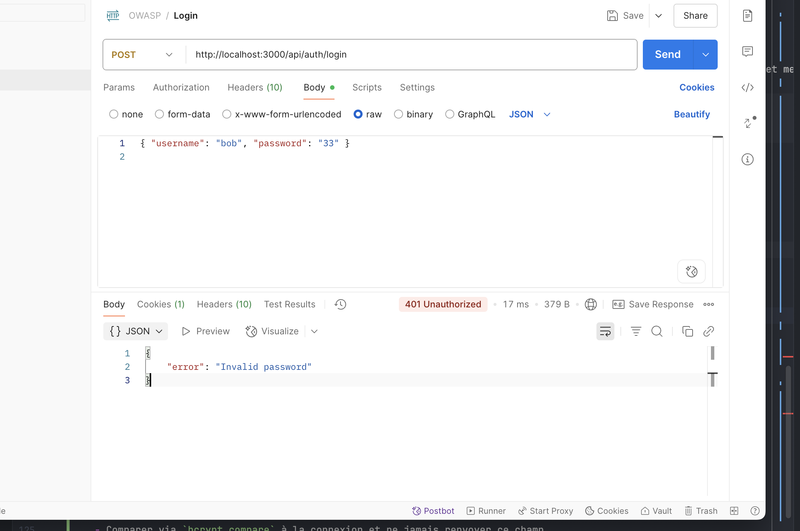

# TP - Rapport de Recherche de Vulnérabilités et Remédiations

## 1. Informations Générales

- **Nom / Binôme : Pierre LE POTTIER & Olivier FALAHI**
- **Date: 6 juin 2025**

---

## 2. Méthodologie

- **Analyse statique :**
    - Lecture rapide du code backend (TypeScript) et frontend (Vue).
    - Repérage des routes critiques et de la configuration Express.
    - Inspection de la gestion des sessions, des accès, des requêtes SQL et des composants Vue (v-html, etc.).
- **Tests dynamiques :**
    - Lancement local de l’application (npm run setup puis npm run dev).
    - Utilisation de Postman pour s’authentifier (POST /api/auth/login) et rejouer les requêtes.
    - Modifications d’URL et de paramètres pour vérifier les contrôles d’accès et tenter des injections.
    - Observation des cookies et des en‑têtes via les outils de développement du navigateur.

---

## 3. Vulnérabilités Identifiées

### 3.2. Broken Authentication

- **Localisation :** configuration de session dans `backend/src/index.ts` et contrôleur `auth.ts`
  ```ts
    app.use(cors({
    origin: process.env.NODE_ENV === 'production'
    ? `https://localhost:${httpsPort}`
    : `http://localhost:8080`,
    credentials: true
    }));
    
    app.use(session({
    store: new SQLiteStore({
    db: 'sessions.db',
    dir: './data',
    expires: 1 * 60 * 60, // 1 heure
    }),
    secret: 'secret-key',
    resave: false,
    saveUninitialized: false,
    name: 'session',
    }));
  ```

  ```ts
    // Inscription
    export async function register(req: Request, res: Response): Promise<any> {
    const { username, password } = req.body;
    await db.run(
    `INSERT INTO users (username, password, role) VALUES (?, ?, 'user')`,
    username, password
    );
    res.status(201).json({ message: 'User registered' });
    }
    
    // Connexion
    export async function login(req: Request, res: Response): Promise<any> {
    const { username, password } = req.body;
    const user = await db.get(`SELECT * FROM users WHERE username = ?`, username);
    if (!user) return res.status(401).json({ error: 'User not exist' });
    if (user.password !== password) return res.status(401).json({ error: 'Invalid password' });
    req.session.user = { id: user.id, role: user.role };
    res.json(user);
    }
    
    // Déconnexion
    export async function logout(_req: Request, res: Response): Promise<any> {
    res.clearCookie('session').json({ message: 'Logged out' });
    }
  ```
- **Preuve de concept :**
    1. Fixation de session : se connecter une première fois et noter la valeur du cookie session. Se reconnecter : la
       valeur est identique.
    2. Absence de sécurité : le cookie n’ayant pas le flag secure, il transite en clair en HTTP (mode dev).


- **Cause :**
    - Le secret de session est codé en dur et aucune option de cookie
    - Aucune régénération de session après connexion ; aucune destruction de session lors du logout

- **Remédiation :**
    - Lire le secret depuis `process.env.SESSION_SECRET`
    - Configurer les cookies :
      ```ts
      cookie: { httpOnly: true, secure: true, sameSite: 'strict' }
      ```
    - Utiliser `req.session.regenerate()` après authentification et `req.session.destroy()` au logout

---

### 3.3. Sensitive Data Exposure

- **Localisation :** mots de passe en clair dans `backend/src/database/seed.ts` et donc pas de hash + les routes login
  et me renvoient également ce champ + les messages d'erreurs lors du login trop précis dans contrôleur `auth.ts`
  ```ts
    const usersData = [
    { username: 'alice',  password: 'N15J9VLiyTmL', role: 'user'  },
    { username: 'bob',    password: '123456',      role: 'user'  },
    { username: 'admin',  password: 'H3qWu6w1Nzkm', role: 'admin' },
  ```


  ```ts
  if (!user) return res.status(401).json({error: 'User not exist'});
if (user.password !== password) return res.status(401).json({error: 'Invalid password'});
  ```



- **Preuve de concept :**
    1. Lancer npm run setup puis ouvrir data/database.db : la table users contient des mots de passe en clair.
    2. Appeler GET http://localhost:3000/api/auth/me : le mot de passe est présent dans la réponse.

- **Cause :**
    - Pas de hash du mot de passe
    - Renvoi du mot de passe lors du login
    - Renvoi d'une erreur trop explicite

- **Remédiation :**
    - Stocker un hash bcrypt au lieu du mot de passe
    ```ts
      const hashedPassword = await bcrypt.hash(password, SALT_ROUNDS);
    ```
    - Comparer via `bcrypt.compare` à la connexion et ne jamais renvoyer ce champ
    - Ne pas différencier un username invalide d'un mot de passe invalide dans la gestion des erreurs renvoyées

---

### 3.5. Security Misconfiguration

- **Localisation :** cors et autres dans `backend/src/index.ts`
  ```ts
  app.use(cors({
  origin: process.env.NODE_ENV === 'production'
  ? `https://localhost:${httpsPort}`
  : `http://localhost:8080`,
  credentials: true
  }));
  ```

  ```ts
  if (process.env.NODE_ENV !== 'production') {
  http.createServer(app).listen(devPort, () => console.log(`🔓 HTTP Server (dev) on http://localhost:${devPort}`));
   ```

- **Cause :**
    - L’origine est fixée à http://localhost:8080 sans contrôle supplémentaire
    - La ligne http.createServer permet un downgrade en HTTP ; aucun en‑tête HSTS ne force le HTTPS
    - Pas de middleware helmet : les en‑têtes de sécurité par défaut sont absents

- **Remédiation :**
    - Restreindre CORS via une whitelist
    ```ts
  const whitelist = process.env.CORS_WHITELIST ? process.env.CORS_WHITELIST.split(',') : [];

  app.use(cors({
    origin: function (origin, callback) {
      if (!origin) return callback(null, true);

      if (whitelist.indexOf(origin) !== -1) {
        callback(null, true);
      } else {
        callback(new Error('Not allowed by CORS'));
      }
    },
    credentials: true
  }));
    ```
    - Activer HSTS en production
    ```ts
  if (process.env.NODE_ENV !== 'production') {
    http.createServer(app).listen(devPort, () => console.log(`🔓 HTTP Server (dev) on http://localhost:${devPort}`));
  } else {
    app.use((req, res, next) => {
      res.setHeader('Strict-Transport-Security', 'max-age=31536000; includeSubDomains; preload');
      next();
    });
   ```
    - Installer helmet
    ```ts
      app.use(helmet());
    ```

### 3.7. Cross-Site Request Forgery (CSRF)

- **Localisation :** le middleware de session dans `backend/src/index.ts`
    ```ts
  app.use(session({
  store: new SQLiteStore({
  db: 'sessions.db',
  dir: './data',
  expires: 1 * 60 * 60, // 1 heure
  }),
  secret: 'secret-key',
  resave: false,
  saveUninitialized: false,
  name: 'session',
  }));
   ```

- **Preuve de concept :**
    1. Démarrer l’application : npm run setup puis npm run dev.
    2. Lancer le fichier [evil.html](evil.html) sur le navigateur (CORS allégés avec le bon port qui va bien)
    3. On observe que le script s'exécute bien et fait un POST avec un cookie qui n'est pas strict.


- **Cause :**
    - Pas de flag SameSite ni mécanisme de jeton CSRF. Aucune route ne vérifie de token CSRF. Ainsi, une requête
      POST/PUT/DELETE envoyée par un autre site utilise automatiquement le cookie de session de l’utilisateur connecté.

- **Remédiation :**
    - Ajouter un middleware CSRF (ex. csurf) et passer le cookie en sameSite strict :
  ```ts
  app.use(csurf({
  cookie: {
  sameSite: 'strict',
  secure: process.env.NODE_ENV === 'production',
  httpOnly: true
  }
  }));

  app.use((req, res, next) => {
  res.cookie('XSRF-TOKEN', req.csrfToken(), {
  sameSite: 'strict',
  secure: process.env.NODE_ENV === 'production',
  httpOnly: false
  });
  next();
  });
   ```
---

### 3.8. Server‑Side Request Forgery (SSRF)