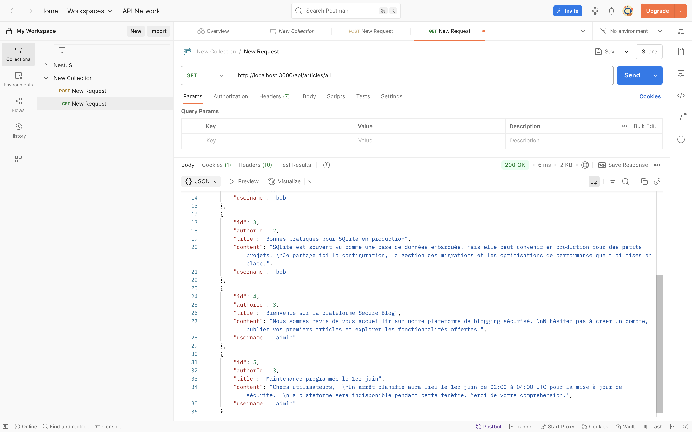
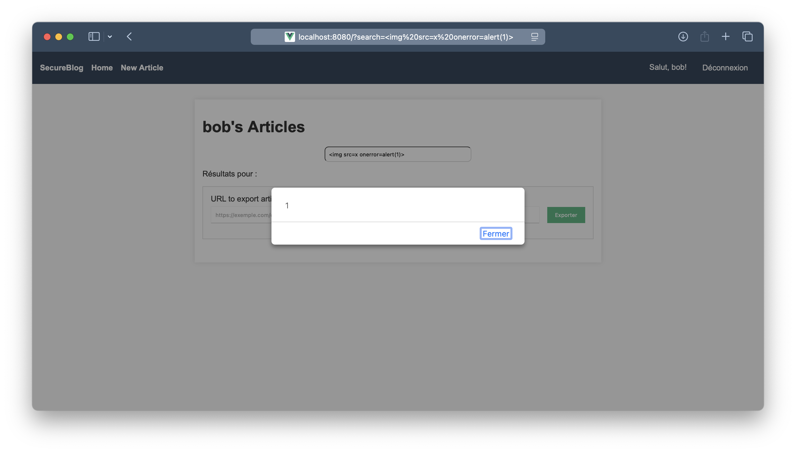
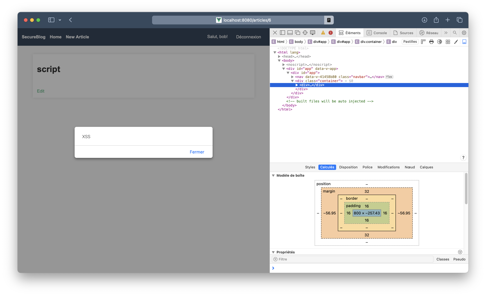

# TP - Rapport de Recherche de Vulnérabilités et Remédiations

## 1. Informations Générales

- **Nom / Binôme :**
- **Date :**

---

## 2. Méthodologie

- **Analyse statique :**
    - Lecture rapide du code backend (TypeScript) et frontend (Vue).
    - Repérage des zones sensibles (concatenation SQL, routes sans validation, gestion des sessions, etc.).
    - ...
- **Tests dynamiques :**
    - Requêtes manuelles avec cURL / Postman / navigateur / Burp Suite.
    - Tentatives d’injection (SQL, paramètre URL, ...) avec quels outils (ex: sqlmap)
    - Contrôle d'accès avec simulation de rôles (admin vs user).
    - Vérification des en-têtes (cookies, CORS).
    - ...

---

## 3. Vulnérabilités Identifiées


### 3.1. Injection SQL

- **Localisation** : `backend/src/controllers/articles.ts` dans la fonction `get` :

```ts
const articleId = req.params.id;
const userId = req.session.user!.id;
const article = await db.get(`SELECT * FROM articles WHERE id='${articleId}' AND authorId=${userId}`);
```

- **Preuve de concept :**

1. Se connecter via Postman :
   ```http
   POST http://localhost:3000/api/auth/login
   { "username": "bob", "password": "123456" }
   ```
2. Envoyer ensuite :

```http
   GET http://localhost:3000/api/articles/0' UNION ALL SELECT group_concat(username || ':' || password, ' | '), NULL, NULL, NULL FROM users --
   ```

3. On récupère des informations sensibles comme les identifiants des utilisateurs :


- **Cause :**

L'identifiant d'article est inséré tel quel dans la requête donc on peut injecter du SQL.

- **Remédiation :**
  Utiliser des requêtes paramétrées :

```ts
const article = await db.get(
  'SELECT * FROM articles WHERE id = ? AND authorId = ?',
  articleId,
  userId
);
```

### 3.4. Broken Access Control

- **Localisation** :

```ts
export async function listAll(_req: Request, res: Response): Promise<any> {
  const articles = await db.all('SELECT articles.*, users.username FROM articles LEFT JOIN users ON (articles.authorId = users.id)');
  res.json(articles);
}
```

```ts
export async function remove(req: Request, res: Response): Promise<any> {
  const articleId = req.params.id;
  await db.run(
          'DELETE FROM articles WHERE id=?',
          articleId
  );
  res.json({ message: 'Deleted' });
}
```

- **Preuve de concept :**
1. Se connecter avec `bob`.
2. Appeler `GET http://localhost:3000/api/articles/all` : tous les articles sont listés.



3. Envoyer `DELETE http://localhost:3000/api/articles/4` pour supprimer un article qui ne lui appartient pas.


- **Cause :**
- `GET /api/articles/all` accessible à tout utilisateur authentifié.
- `PUT` et `DELETE /api/articles/:id` ne vérifient pas l'auteur.

**Correctifs**
- Restreindre `/all` aux administrateurs en ajoutant le middleware `roleRequired`:
```ts
  router.get('/all', roleRequired('admin'), listAll);
   ```
- Vérifier `authorId` avant modification ou suppression.

```ts
export async function remove(req: Request, res: Response): Promise<any> {
const userId = req.session.user!.id;
const articleId = req.params.id;
const result = await db.run(
'DELETE FROM articles WHERE id=? AND authorId=?',
articleId,
userId
);

if (result.changes === 0) {
return res.status(403).json({ error: 'Something went wrong' });
}
res.json({ message: 'Deleted' });
}
```

### 3.6. Cross-Site Scripting (XSS)

- **Localisation** :

`frontend/src/views/Home.vue` et `frontend/src/views/Article.vue`

- **Preuve de concept :**
- Si on visite `http://localhost:8080/?search=`, l'image est chargée et le script s'exécute.



- Si on crée un article avec ``, le script s'exécute lors de la visualisation de l'article.



- **Cause :**
- Résultats de la recherche `Home.vue` utilise `v-html` sur les paramètres de la recherche, authorisant le XSS à la volée.
- Le contenu de l'article est rendu avec `v-html`, authorisant le XSS stocké.

**Correctifs**
- Utiliser une bibliothèque comme `DOMPurify` pour nettoyer le contenu avant de l'afficher.

- Exemple de correction dans `Home.vue` :
```ts
const searchQueryRaw = computed(() => {
  const s = route.query.search
  return typeof s === 'string' ? DOMPurify.sanitize(s) : ''
})
```
- Exemple de correction dans `Article.vue` :
```ts
safeContent = DOMPurify.sanitize(article.value.content)
```
```html
    <p v-html="safeContent"></p>
```
